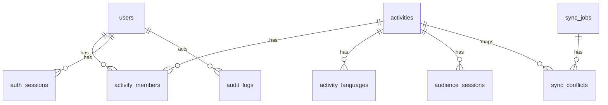

# CWcomm 数据模型草案（MVP）

> 状态：Draft v0.1（与 `docs/api-draft.md`、`docs/system-architecture.md` 对齐）

---

## 1. 设计原则

- 优先满足 MVP 业务闭环：活动、身份、会话、同步、审计。
- 关键状态字段显式建模，避免“字符串魔法值”。
- 外部集成相关字段可追溯（来源、版本、同步时间、任务 ID）。
- 支持审计与排障（请求 ID、操作者、动作、对象、结果）。

---

## 2. 枚举定义（建议）

- `activity_source`：`local | climate_week_api`
- `activity_state`：`DRAFT | READY | LIVE | ENDED | ARCHIVED`
- `activity_role`：`viewer | operator | admin`
- `sync_job_status`：`QUEUED | RUNNING | PARTIAL_SUCCESS | SUCCESS | FAILED`
- `sync_conflict_status`：`PENDING | RESOLVED`
- `sync_resolution`：`USE_REMOTE | KEEP_LOCAL | MERGE_FIELDS`
- `audit_result`：`SUCCESS | FAIL`

---

## 3. 核心表设计

### 3.1 `users`

用途：本地用户主档（含 SSO 映射）

关键字段：
- `id` `varchar(32)` PK
- `display_name` `varchar(128)` not null
- `email` `varchar(254)` null
- `auth_provider` `varchar(32)` not null default `'local'`
- `external_subject` `varchar(191)` null
- `default_role` `varchar(16)` not null default `'viewer'`
- `status` `varchar(16)` not null default `'active'`
- `created_at` `timestamptz` not null
- `updated_at` `timestamptz` not null

约束与索引：
- `unique(auth_provider, external_subject)`（外部账号唯一绑定）
- `index(email)`
- `check(default_role in ('viewer','operator','admin'))`

### 3.2 `activities`

用途：活动主数据

关键字段：
- `id` `varchar(32)` PK
- `source` `varchar(32)` not null
- `external_source` `varchar(32)` null
- `external_id` `varchar(128)` null
- `title` `varchar(256)` not null
- `description` `text` null
- `venue` `varchar(256)` null
- `start_at` `timestamptz` not null
- `end_at` `timestamptz` not null
- `source_language` `varchar(16)` not null
- `state` `varchar(16)` not null default `'DRAFT'`
- `join_code` `varchar(16)` null
- `join_token_expires_at` `timestamptz` null
- `qr_code_url` `text` null
- `sync_status` `varchar(32)` not null default `'NOT_APPLICABLE'`
- `last_synced_at` `timestamptz` null
- `source_version` `varchar(64)` null
- `created_by` `varchar(32)` not null
- `updated_by` `varchar(32)` not null
- `created_at` `timestamptz` not null
- `updated_at` `timestamptz` not null

约束与索引：
- `unique(external_source, external_id)`（外部活动唯一映射）
- `unique(join_code)`（可为空）
- `index(state, start_at)`
- `index(source, external_source)`
- `check(start_at < end_at)`

### 3.3 `activity_languages`

用途：活动目标语种列表

关键字段：
- `id` `bigserial` PK
- `activity_id` `varchar(32)` FK -> `activities.id`
- `language_code` `varchar(16)` not null
- `is_enabled` `boolean` not null default `true`
- `created_at` `timestamptz` not null

约束与索引：
- `unique(activity_id, language_code)`
- `index(activity_id)`

### 3.4 `activity_members`

用途：活动级角色授权

关键字段：
- `id` `bigserial` PK
- `activity_id` `varchar(32)` FK -> `activities.id`
- `user_id` `varchar(32)` FK -> `users.id`
- `role` `varchar(16)` not null
- `granted_by` `varchar(32)` not null
- `created_at` `timestamptz` not null
- `updated_at` `timestamptz` not null

约束与索引：
- `unique(activity_id, user_id)`
- `index(user_id, activity_id)`
- `check(role in ('viewer','operator','admin'))`

### 3.5 `auth_sessions`

用途：登录会话（访问/刷新令牌管理）

关键字段：
- `id` `varchar(32)` PK
- `user_id` `varchar(32)` FK -> `users.id`
- `access_token_hash` `varchar(128)` not null
- `refresh_token_hash` `varchar(128)` not null
- `issued_at` `timestamptz` not null
- `expires_at` `timestamptz` not null
- `last_seen_at` `timestamptz` null
- `revoked_at` `timestamptz` null
- `client_meta` `jsonb` null

约束与索引：
- `index(user_id, expires_at)`
- `index(refresh_token_hash)`

### 3.6 `audience_sessions`

用途：听众实时会话

关键字段：
- `id` `varchar(32)` PK
- `activity_id` `varchar(32)` FK -> `activities.id`
- `user_id` `varchar(32)` null FK -> `users.id`
- `preferred_language` `varchar(16)` not null
- `connection_state` `varchar(16)` not null default `'INIT'`
- `last_event_id` `varchar(64)` null
- `client_meta` `jsonb` null
- `started_at` `timestamptz` not null
- `ended_at` `timestamptz` null

约束与索引：
- `index(activity_id, connection_state)`
- `index(user_id, started_at)`

### 3.7 `sync_jobs`

用途：外部同步任务主表

关键字段：
- `id` `varchar(32)` PK
- `provider` `varchar(32)` not null default `'climate_week'`
- `trigger_type` `varchar(16)` not null (`manual|schedule|retry`)
- `window_start_at` `timestamptz` null
- `window_end_at` `timestamptz` null
- `status` `varchar(32)` not null
- `total_count` `int` not null default `0`
- `success_count` `int` not null default `0`
- `failed_count` `int` not null default `0`
- `conflict_count` `int` not null default `0`
- `error_summary` `text` null
- `created_by` `varchar(32)` null
- `started_at` `timestamptz` null
- `finished_at` `timestamptz` null
- `created_at` `timestamptz` not null

约束与索引：
- `index(provider, status, created_at)`
- `index(created_by, created_at)`

### 3.8 `sync_conflicts`

用途：同步冲突记录与人工处置

关键字段：
- `id` `varchar(32)` PK
- `job_id` `varchar(32)` FK -> `sync_jobs.id`
- `activity_id` `varchar(32)` null FK -> `activities.id`
- `external_id` `varchar(128)` not null
- `field_path` `varchar(128)` not null
- `local_value` `jsonb` null
- `remote_value` `jsonb` null
- `status` `varchar(16)` not null default `'PENDING'`
- `resolution` `varchar(32)` null
- `resolved_by` `varchar(32)` null
- `resolved_at` `timestamptz` null
- `created_at` `timestamptz` not null

约束与索引：
- `index(job_id, status)`
- `index(activity_id, status)`

### 3.9 `idempotency_keys`

用途：幂等去重

关键字段：
- `id` `bigserial` PK
- `idempotency_key` `varchar(80)` not null
- `scope` `varchar(64)` not null
- `request_hash` `varchar(128)` not null
- `response_snapshot` `jsonb` not null
- `expires_at` `timestamptz` not null
- `created_at` `timestamptz` not null

约束与索引：
- `unique(idempotency_key, scope)`
- `index(expires_at)`

### 3.10 `audit_logs`

用途：关键操作审计

关键字段：
- `id` `varchar(32)` PK
- `request_id` `varchar(64)` null
- `actor_user_id` `varchar(32)` null
- `actor_type` `varchar(32)` not null (`user|system`)
- `action` `varchar(64)` not null
- `target_type` `varchar(64)` not null
- `target_id` `varchar(64)` not null
- `result` `varchar(16)` not null
- `error_code` `varchar(64)` null
- `metadata` `jsonb` null
- `created_at` `timestamptz` not null

约束与索引：
- `index(action, created_at)`
- `index(target_type, target_id)`
- `index(actor_user_id, created_at)`

---

## 4. 状态迁移与数据完整性规则

- 活动状态迁移由服务层控制，数据库层可加触发器保护非法迁移。
- `LIVE` 时禁止修改关键字段（`source_language`、音频配置）可通过应用层 + 触发器双重保护。
- 删除策略建议软删除（`deleted_at`）以保留审计可追溯性。

---

## 5. 关系图（ER 简化）

---

## 6. 分区与归档建议

- `audit_logs` 建议按月分区（按 `created_at`）。
- `audience_sessions` 建议保留明细 30~90 天，之后聚合归档。
- `idempotency_keys` 定时清理过期数据。

---

## 7. 迁移顺序建议

1. 先建字典枚举与主表：`users`、`activities`。
2. 再建关系表：`activity_languages`、`activity_members`。
3. 再建运行表：`auth_sessions`、`audience_sessions`。
4. 再建集成表：`sync_jobs`、`sync_conflicts`。
5. 最后建治理表：`idempotency_keys`、`audit_logs`。

---

## 8. 待确认项

1. ID 方案：`snowflake`、`ulid` 还是 DB 序列。
2. `auth_sessions` 是否落库完整 token 还是仅存 hash。
3. 审计日志保留周期与合规要求（按地区差异）。
4. 冲突处置是否需要“批量规则”能力（例如字段级默认策略）。
