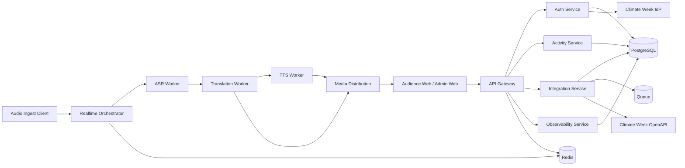

# CWcomm 系统架构说明（MVP）

> 状态：Draft v0.1（与 `docs/functional-analysis.md`、`docs/api-draft.md` 对齐）

---

## 1. 架构目标

- 端到端延迟满足 2~6 秒目标区间。
- 单活动支持 500 人级并发收听（MVP 参考值）。
- 外部依赖故障可降级（OpenAPI/SSO/TTS 不可用时服务可继续）。
- 组件边界清晰，支持后续多会场扩展。

---

## 2. 逻辑组件

### 2.1 客户端层
- `Audience Web App`：扫码加入、语种切换、字幕/音频播放、断线重连。
- `Admin Console`：活动管理、状态控制、同步触发、运行监控。
- `Audio Ingest Client`：采集端音频上传与输入健康状态上报。

### 2.2 应用服务层
- `API Gateway`：统一鉴权、限流、路由、请求追踪。
- `Auth Service`：本地会话、token 刷新、SSO 回调、用户映射。
- `Activity Service`：活动 CRUD、状态机、成员角色授权。
- `Realtime Orchestrator`：会话编排、语种订阅、降级策略下发。
- `Integration Service`：气候周活动同步、冲突检测、重试与任务状态。
- `Observability Service`：指标聚合、审计日志、告警事件。

### 2.3 AI 与媒体处理层
- `ASR Stream Worker`：流式识别。
- `Translation Worker`：多语种并行翻译。
- `TTS Worker`：目标语种语音生成（可关闭并字幕兜底）。
- `Media Distribution`：WebRTC/实时音频分发与字幕事件发布。

### 2.4 数据与基础设施层
- `PostgreSQL`：活动、用户、角色、同步任务、审计日志。
- `Redis`：会话缓存、短期事件游标、幂等键、限流计数。
- `Object Storage`：二维码、活动静态附件。
- `Message Queue`：同步任务、重试队列、死信队列。

---

## 3. 端到端数据流

### 3.1 实时转译主链路
1. 采集端推送音频流到 `Realtime Orchestrator`。
2. 音频分发给 `ASR Stream Worker`，生成 `TranscriptSegment`。
3. 文本并发发送到 `Translation Worker` 生成多语种片段。
4. 语音模式下发送至 `TTS Worker` 生成音频片段。
5. `Media Distribution` 向听众端推送字幕与音频。
6. 客户端 ACK/心跳反馈回 `Realtime Orchestrator`。

### 3.2 活动同步链路
1. 管理端触发重同步或定时任务触发。
2. `Integration Service` 调用气候周 OpenAPI 拉取活动数据。
3. 执行字段映射与冲突检测。
4. 写入活动表、同步状态表、冲突队列与审计日志。

### 3.3 登录链路
1. 前端请求 SSO 登录 URL。
2. 用户在气候周身份平台认证后回调。
3. `Auth Service` 换取 token 并读取用户信息。
4. 本地建档/绑定后签发 CWcomm 会话令牌。

---

## 4. 状态与权限设计

### 4.1 活动状态机
- `DRAFT -> READY -> LIVE -> ENDED -> ARCHIVED`

约束：
- `READY/LIVE` 才允许听众加入。
- `LIVE` 期间禁止修改关键实时参数。

### 4.2 角色模型
- `viewer`：加入并收听。
- `operator`：操作音频接入与运行态。
- `admin`：管理活动与角色授权。

授权原则：
- 以活动级角色优先，全局角色仅作默认值。

---

## 5. 部署拓扑（MVP 建议）

---

## 6. 高可用与降级策略

- `TTS` 不可用：切换 `SUBTITLE_ONLY` 并广播 `pipeline.degraded`。
- 弱网：优先字幕，音频降码率与增缓冲。
- OpenAPI 不可用：保留最近快照，重试并标记 `syncStatus=DELAYED`。
- IdP 短时不可用：已登录会话继续，新登录失败快速返回并审计。

---

## 7. 可观测性与审计

关键指标：
- 端到端延迟（采集->识别->翻译->分发分段）。
- 字幕/音频错误率。
- 在线听众数、重连次数、会话成功率。
- 同步成功率、冲突率、外部 API 错误率。

关键审计事件：
- 登录/登出、角色变更、活动状态迁移、同步触发/失败、降级切换。

---

## 8. 架构决策待确认

1. 媒体分发主方案：WebRTC 与纯 WS 音频分片的最终取舍。
2. token 形态：JWT 与 Opaque Token 的实现选择。
3. 重放窗口：字幕回放时长与存储成本上限。
4. 多区域部署时钟同步方案与跨区延迟预算。
